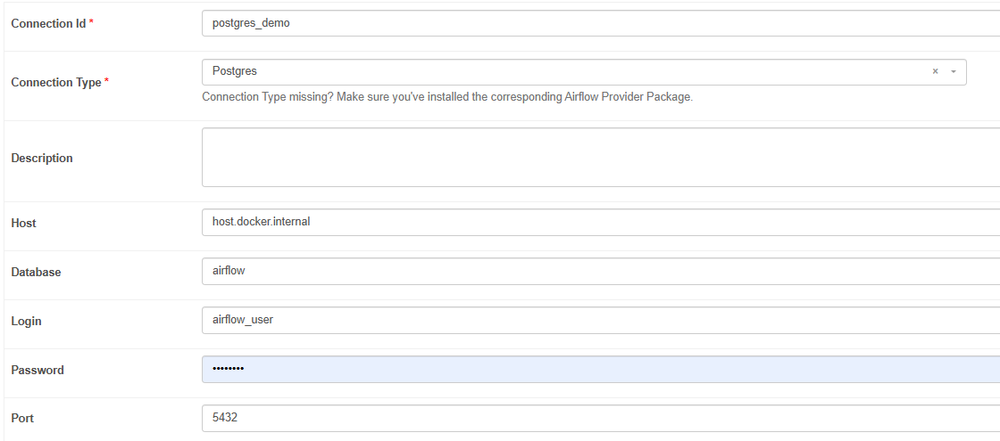
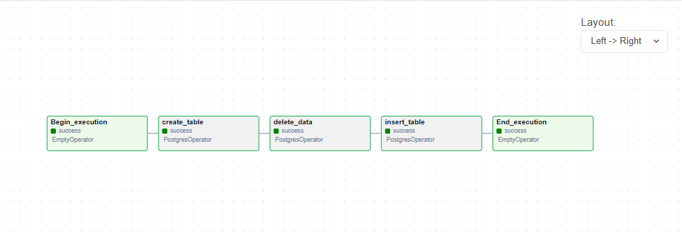
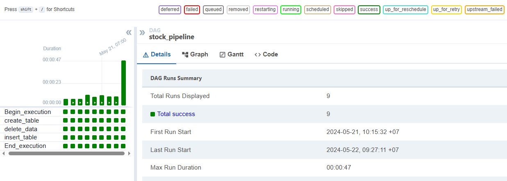
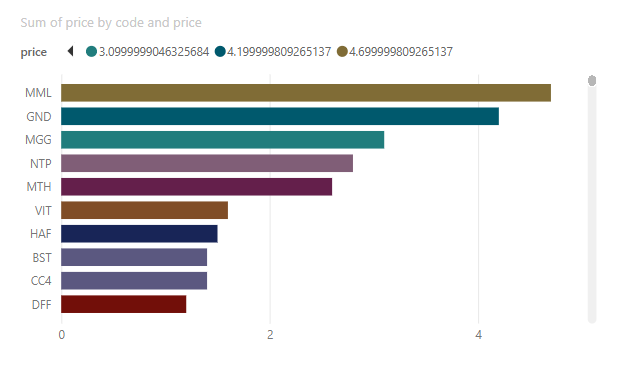

# Stock-Market-Analysis

This a project of Stock Market Analysis And Forecasting Using Deep Learning(pytorch,gru).

A stock market, equity market, or share market is the aggregation of buyers and sellers of stocks (also called shares), which represent ownership claims on businesses; these may include securities listed on a public stock exchange, as well as stock that is only traded privately, such as shares of private companies which are sold to investors through equity crowdfunding platforms. Investment in the stock market is most often done via stockbrokerages and electronic trading platforms. Investment is usually made with an investment strategy in mind.

Market analysis is an important tool to help investors and traders understand and make informed decisions about the stock market. It provides information and insights into the factors and fluctuations within the market, thereby helping to optimize profits and manage risks in stock trading activities.

In the first part of the project, we will try to implement data scraping. And in the second part, we do push the data to the database. And finally create a dashboard to clearly display information.

## Information-About-Collected-Data

- Stock Code: This is a unique identifier for each company listed on the stock market. Each company will have its own stock code so investors can identify and trade.

- Reference Price: This is the price determined before trading begins in a trading session. Reference prices are often used to compare with the actual price of a stock during a trading session.

- Ceiling Price: This is the maximum price a stock is allowed to increase in a trading session. If the stock price exceeds the price ceiling, it cannot be traded at a higher price.

- Floor Price: This is the minimum price at which a stock is allowed to fall during a trading session. If the stock price is below the floor price, it cannot be traded at the lower price.

- Price: This is the actual price of the stock during the trading session. This price can change over time and reflects the interaction between buyers and sellers in the market.

- Volume: This is the number of shares that have been traded in the current trading session. It measures a stock's liquidity and indicates investor interest and trading activity.

- Total Volume: This is the total number of shares that have been traded from the beginning of the trading session to the present during that trading day.

- Total Value: This is the total value of all stocks that have been traded from the beginning of the trading session to the present during that trading day. It is calculated by multiplying the price of the stock by its corresponding volume.

- Highest Price: This is the highest price the stock has reached in the current trading session.

Lowest Price: This is the lowest price the stock has reached in the current trading session.

- Average Price: This is the average price of the stock calculated by dividing the total value of all transactions by the total volume. It provides an overview of the average value of the stock during the trading session.

## Set up Airflow

## Result
Top 10 stocks with the highest value

